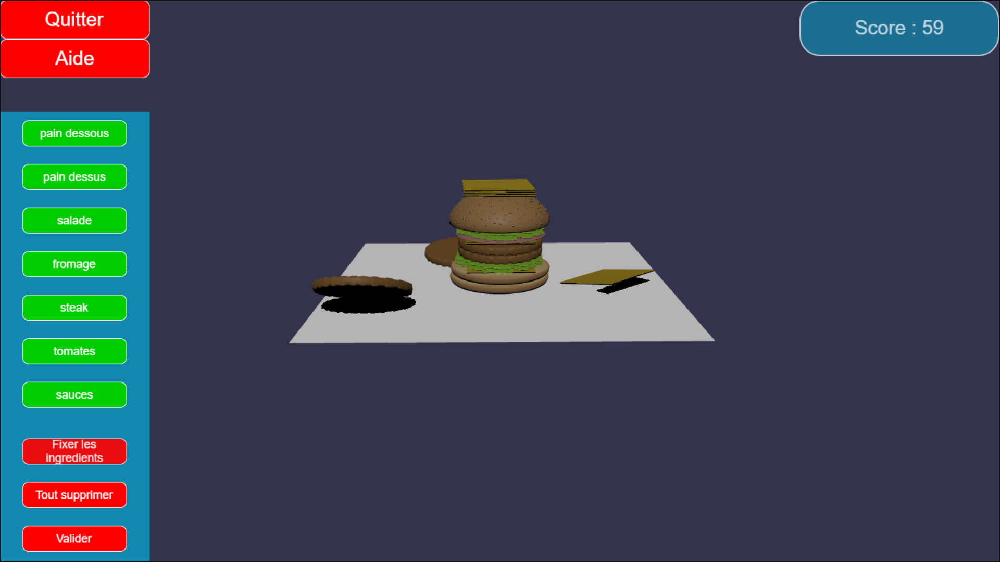
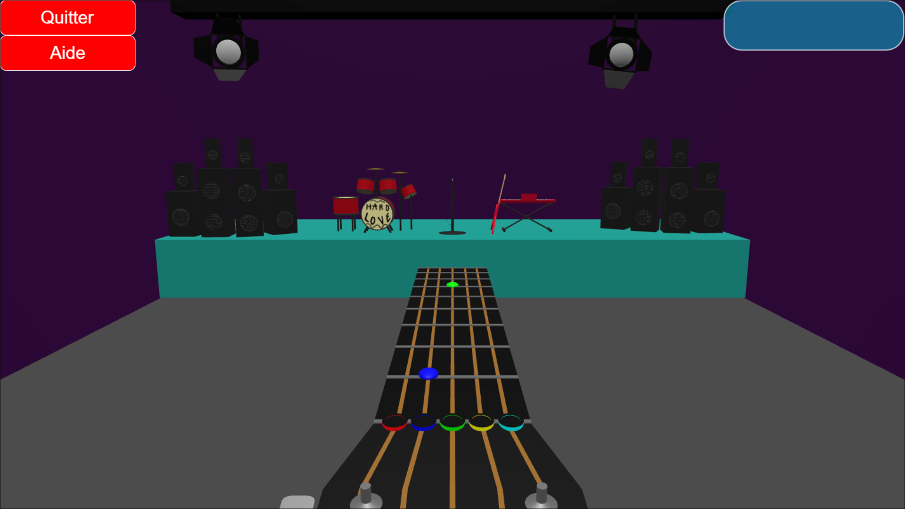

# Ma présentation:

Je suis en PeiP 2 à Polytech.  
Je suis tout seul parce que je suis débile.
 
     
 
# Création du jeu:

Ma première idée était Burger War : Un jeu passionnant où on doit créer le meilleur burger possible.  
Pour cela, on a des boutons qui font tomber les ingrédients.  
J'ai abandonné ce jeu à cause d'une vague de contrôles et d'un bug persistant.   

 
    
 
Ma deuxième idée était plutôt bien :  
On est placé dans un openworld (comme Skyrim ou un Final Fantaisy), il y a des ennemis et quand on les touche, un combat est lancé.  
Le but est donc de gagner de l'XP, du meilleur équipement et des niveaux pour aller combattre des boss toujours plus puisssants.  
Les combats sont plagiés de Guitar Hero : les notes descendent et il faut taper au bon moment.  
J'ai finalement abandonné ce projet pour plusieurs raisons:  
- C'est moche!!! 
- Avoir un openworld intéressant est plus compliqué que ce que je pensais.
- Les combats sont durs, répétitifs et chiants, ce qui fait le génie de Guitar Hero, c'est la guitare.
- Je n'ai pas réussi à lier une musique aux notes qui descendent.

 
    
 
Et c'est à ce moment là que j'ai réalisé qu'il restait un peu plus d'une semaine.  
Dernière idée, il faut produire et arréter de réfléchir.  
J'ai pris toutes mes poubelles qui trainaient, je les ai foutues dans un même jeu et tada!  

   

Oui je sais que j'écris comme un caca
